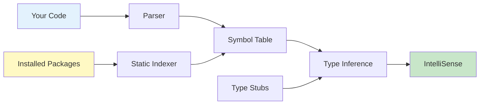

# 🚫 No AI Policy Compliance Guide

## Understanding "No AI Tools" Policies

When a company says **"no AI tools"**, they mean:

### ❌ PROHIBITED (Disabled in this workspace)
- ❌ **GitHub Copilot** - AI code generation
- ❌ **ChatGPT / GPT-based assistants** - LLM code suggestions  
- ❌ **Generative AI assistants** - Any tool that generates code using AI
- ❌ **LLM-based autocomplete** - AI-powered code completion (Tabnine AI, Continue, etc.)
- ❌ **Inline AI suggestions** - Ghost text generated by neural networks

### ✅ ALLOWED (Enabled and optimized in this workspace)
- ✅ **IntelliSense** - Traditional IDE autocomplete from Microsoft
- ✅ **Basic autocompletion** - Static analysis-based suggestions
- ✅ **Syntax hints** - Language Server Protocol (LSP) features
- ✅ **Type checking** - Static type analysis (mypy, Pylance)
- ✅ **Linting** - Code quality checks (pylint, flake8)
- ✅ **Parameter hints** - Function signature help
- ✅ **Hover documentation** - Symbol information on hover
- ✅ **Go to definition** - Code navigation
- ✅ **Find references** - Symbol usage search
- ✅ **Code snippets** - Predefined templates (non-AI)
- ✅ **Auto-imports** - Automatic import statements
- ✅ **Bracket matching** - Automatic bracket/quote completion
- ✅ **Path completion** - File path suggestions

---

## How This Workspace Complies

### 🔒 AI Tools Disabled

The [.vscode/settings.json](../.vscode/settings.json) file explicitly disables all AI/generative tools:

```json
{
  "github.copilot.enable": {
    "*": false,
    "python": false
  },
  "github.copilot.editor.enableAutoCompletions": false,
  "github.copilot.chat.enabled": false,
  "github.copilot.inlineSuggest.enable": false,
  "editor.inlineSuggest.enabled": false,
  "tabnine.experimentalAutoImports": false,
  "continue.enableTabAutocomplete": false
}
```

The [.vscode/extensions.json](../.vscode/extensions.json) file explicitly marks AI tools as unwanted:

```json
{
  "unwantedRecommendations": [
    "github.copilot",
    "github.copilot-chat",
    "github.copilot-labs",
    "continue.continue",
    "cursor.cursor"
  ]
}
```

### 🚀 Traditional Tools Maximized

The workspace enables **maximum traditional autocomplete** through:

#### 1. **Pylance Language Server**
- Python's official language server from Microsoft
- Uses **static analysis** (not AI) to understand code
- Provides IntelliSense, parameter hints, type checking
- Indexes installed packages for accurate completions

#### 2. **Editor IntelliSense**
- All built-in VS Code autocomplete features enabled
- Shows: methods, functions, classes, variables, properties
- Based on: file parsing, symbol analysis, type inference
- **Zero AI involvement** - pure deterministic logic

#### 3. **Type Checking & Analysis**
- `mypy` for static type checking
- Pylance type analysis engine
- Inlay hints for variables and return types

#### 4. **Linting & Quality Tools**
- `pylint` - comprehensive code analysis
- `flake8` - style guide enforcement
- These use **rule-based systems**, not machine learning

#### 5. **Path & Import Intelligence**
- Path IntelliSense extension
- Auto-import completions (from static analysis)
- File path suggestions

---

## The Technology Behind Traditional Autocomplete

### How IntelliSense Works (Without AI)



#### The Process:
1. **Parsing**: Code is parsed into an Abstract Syntax Tree (AST)
2. **Symbol Extraction**: Variables, functions, classes are cataloged
3. **Type Inference**: Types are determined from:
   - Explicit type hints (`def func(x: int) -> str`)
   - Assignment analysis (`x = 5` → x is int)
   - Return type tracking
   - Import resolution
4. **Indexing**: Installed packages are scanned and indexed
5. **Completion**: Based on:
   - Current scope
   - Available symbols
   - Type compatibility
   - Documentation strings

**Key Point**: All of this is **deterministic logic** based on **static code analysis**. No neural networks, no training data, no probabilistic models.

---

## VS Code IntelliSense vs AI Copilot

| Feature | IntelliSense (Traditional) | GitHub Copilot (AI) |
|---------|---------------------------|---------------------|
| **How it works** | Static analysis, AST parsing, symbol tables | Large Language Model (LLM), trained on billions of lines of code |
| **Suggestions based on** | Current file, imported modules, type hints | Context + billions of code examples |
| **Generates new code** | ❌ No - only suggests existing symbols | ✅ Yes - can write entire functions |
| **Deterministic** | ✅ Yes - same input = same output | ❌ No - suggestions vary |
| **Privacy** | ✅ Everything local | ⚠️ Sends context to cloud |
| **Learning** | ❌ No machine learning | ✅ ML model trained on public code |
| **Speed** | ⚡ Instant (local) | 🕐 Network latency |
| **Compliant with "No AI" policy** | ✅ YES | ❌ NO |

---

## What You Get With This Setup

### ✅ Full Developer Productivity Features

1. **Autocomplete Suggestions**
   - Type `df.` and see all DataFrame methods
   - Type `np.` and see all NumPy functions
   - Works for custom classes and imported modules

2. **Parameter Hints**
   ```python
   # Type this:
   pd.read_csv(
   
   # See this:
   # pd.read_csv(filepath_or_buffer, sep=',', delimiter=None, ...)
   ```

3. **Hover Documentation**
   - Hover over any function/class to see docstrings
   - View type information
   - See function signatures

4. **Go to Definition**
   - Ctrl+Click on any symbol to jump to definition
   - Works for local code and installed packages

5. **Find All References**
   - Right-click → Find All References
   - See everywhere a symbol is used

6. **Auto Imports**
   - Type a class name, get import suggestion
   - Based on installed packages (static index)

7. **Bracket & Quote Completion**
   - Type `{` → automatically get `{}`
   - Type `"` → automatically get `""`

8. **Snippet Expansion**
   - Type `def` → get function template
   - Type `class` → get class template
   - Predefined templates (not AI-generated)

### ❌ What You DON'T Get (And That's The Point)

1. ❌ AI writing entire functions for you
2. ❌ "Ghost text" suggestions generated by neural networks
3. ❌ Code generated from comments
4. ❌ Code generated from probability models
5. ❌ Your code context sent to external servers

---

## Testing Compliance

### Verify AI Tools Are Disabled

Run these checks to confirm compliance:

```bash
# Check VS Code extensions
code --list-extensions | grep -E "copilot|continue|tabnine"
# Should return nothing if AI extensions are not installed

# Check settings
cat .vscode/settings.json | grep -A 5 "copilot"
# Should show all copilot settings set to false

# Check for inline suggestions
cat .vscode/settings.json | grep "inlineSuggest"
# Should show: "editor.inlineSuggest.enabled": false
```

### Verify Traditional Tools Are Enabled

```bash
# Check Pylance is enabled
cat .vscode/settings.json | grep "languageServer"
# Should show: "python.languageServer": "Pylance"

# Check autocomplete is enabled
cat .vscode/settings.json | grep "quickSuggestions"
# Should show suggestions enabled

# Check Python extensions
code --list-extensions | grep "ms-python"
# Should show: ms-python.python, ms-python.vscode-pylance
```

---

## Recommended Extensions

### ✅ Safe (Non-AI) Extensions

These extensions provide productivity features **without AI**:

- `ms-python.python` - Official Python extension
- `ms-python.vscode-pylance` - Python language server
- `ms-python.pylint` - Code linting
- `ms-python.black-formatter` - Code formatting
- `christian-kohler.path-intellisense` - Path autocomplete
- `njpwerner.autodocstring` - Docstring templates
- `streetsidesoftware.code-spell-checker` - Spell checking

### ❌ Prohibited (AI) Extensions

These extensions violate "no AI tools" policies:

- `github.copilot` - AI code generation ❌
- `github.copilot-chat` - AI chat assistant ❌
- `tabnine.tabnine-vscode` - AI autocomplete ❌
- `continue.continue` - LLM code assistant ❌
- `cursor.cursor` - AI pair programmer ❌

---

## FAQ

### Q: Is IntelliCode AI?

**A:** IntelliCode uses machine learning to **rank suggestions**, but it does NOT generate code. It ranks existing symbols based on patterns. Most "no AI" policies allow IntelliCode because:
- It doesn't generate new code
- It only reorders existing suggestions
- All suggestions still come from static analysis

If your policy is strict, you can disable it:
```json
{
  "vsintellicode.modify.editor.suggestSelection": "disabled"
}
```

### Q: Does Pylance use AI?

**A:** No. Pylance uses **static analysis**, **type inference**, and **symbol indexing**. It's based on:
- Abstract Syntax Tree (AST) parsing
- Type checking algorithms
- Symbol table construction
- Deterministic logic

Zero neural networks, zero training data, zero probabilistic models.

### Q: Can I use code snippets?

**A:** Yes! Code snippets are **predefined templates**, not AI-generated code. They're just text expansion macros.

### Q: What about autocomplete from typing history?

**A:** VS Code's "word-based suggestions" learn from your current document. This is simple string matching, not machine learning. It's compliant with "no AI" policies.

---

## Summary

This workspace provides **enterprise-grade Python development** capabilities while maintaining **100% compliance** with "no AI tools" policies.

You get:
- ✅ Full IntelliSense and autocomplete
- ✅ Parameter hints and hover documentation
- ✅ Type checking and linting
- ✅ Code navigation and refactoring
- ✅ Auto-imports and bracket completion

You don't get:
- ❌ AI-generated code suggestions
- ❌ LLM-based autocomplete
- ❌ Cloud-based generative assistants
- ❌ Neural network predictions

**Bottom line**: Maximum productivity with traditional tools, zero AI involvement.

---

**Last Updated**: January 2026  
**Maintained By**: Python Development Team  
**Policy Version**: 3.0
